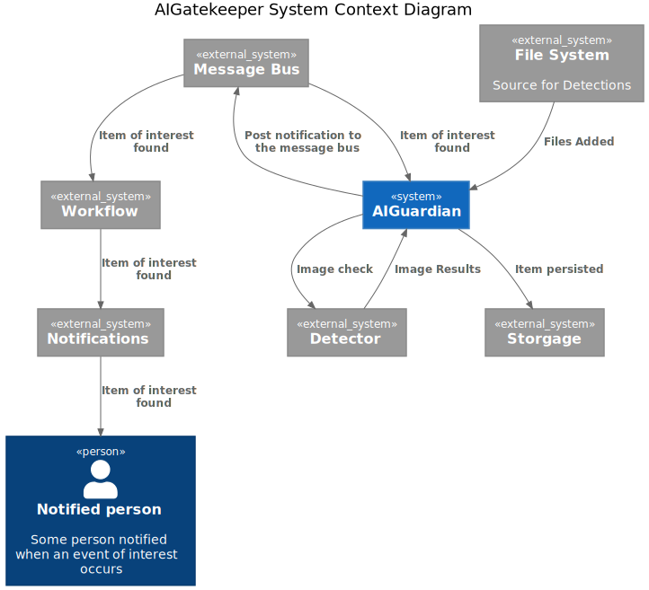
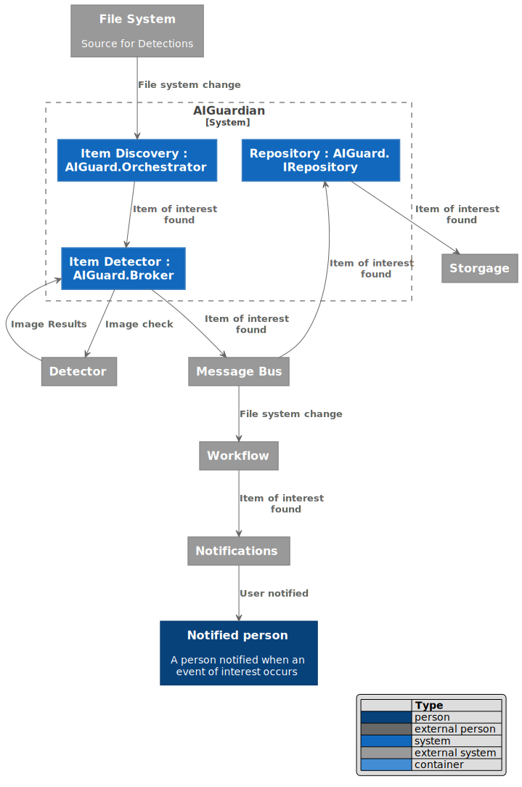

 [](https://github.com/johnhinz/AIGatekeeper/blob/master/LICENSE)

# AIGateKeeper

The goal of this library is to design a tool that would watch a folder for specific files, send them to an AI discovery tool and take some action if an appropriate subject is found.
The library has abstracted the AI discovery tool and the repository.  There are implementations for [DeepStack](https://deepstack.cc/)  and [MQTT](https://github.com/chkr1011/MQTTnet).

## Requirements
An implementation of AI discovery tool that corresponds to AIGuard.Broker and a repository that corresponds to AIGuard.IRepository.

## Architecture
### System Context


### Container 



## Installation
Configuration parmeters:
```
AIEndpoint : The URL of the AI discovery tool.
PublisherName : The client name connecting to the repository
TopicParser : A regex that determines the topic as derived from the image file name
TopicPosition : The position of the topic as derived from the image file name
QueueName : The repository queue name
WatchFolder : The folder to watch for new files.  These files are passed to the AIEndpoint for discovery
LogFile : The full path and file name where logs are written
WatchedExtensions : The file extension types passed to the AIEndpoint (these file types, if created in the watch folder will be passed to the AIEndpoint)
RepositoryEndpoint : The repository endpoint.
Cameras : A Javascript array containing a list of cameras.
  [ 
    {
      "name": "east",   Name of the camera.  The value must be a substring of the image filename.
      "clip": false,    True will crop the image to the object of interest, false will send the whole image with a target in a bounded rectangle
      "watches": [      A Javascript array containing the items of interest and the confidence level required to produce a match
        {
          "label": "person",   The title of an object of interest
          "confidence": 0.75   The confidence level that will produce a match
        },
        {
          "label": "car",   
          "confidence": 0.75   
        }
      ]
    }
  ]
```